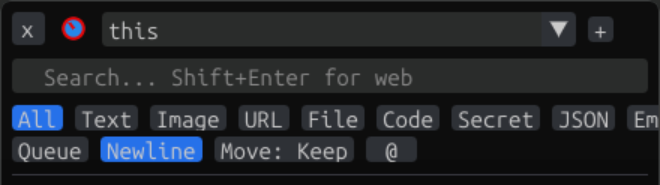
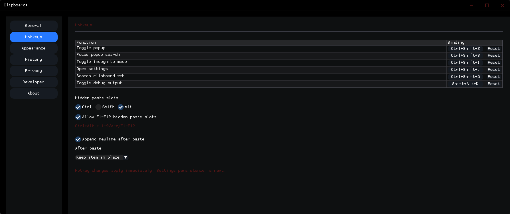
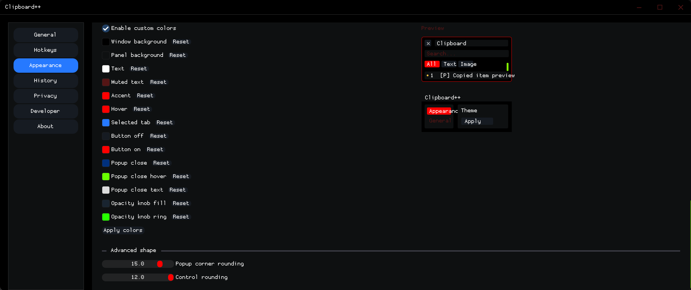

# Clipboard++

Clipboard++ is a Windows clipboard manager built with C++17, Win32, Dear ImGui, DirectX 11, and CMake. It runs as a system tray app with a main settings window, an always-on-top quick paste popup, configurable hotkeys, multiple named clipboard profiles, and a command-line interface for automation.

Clipboard++ is developed by james28909 with AI-assisted development support from OpenAI Codex and Claude. See [CONTRIBUTORS.md](CONTRIBUTORS.md) for project attribution.

## Screenshots

Quick paste popup:


Popup with history and controls:


Popup controls detail:



General settings:


Hotkeys settings:



Appearance settings (page 1):


Appearance settings (page 2):


Appearance settings (page 3):



System tray popup:


## Features

### Clipboard Capture
- Monitors the Windows clipboard continuously for text, images, file/folder paths, and structured content
- Automatic deduplication — re-copying the same content moves it in the history rather than creating a duplicate
- Configurable max history size (1–8192 items)
- Optional history persistence across sessions (per-profile JSON files under `%APPDATA%\Clipboard++\history\`)
- Source process tracking — each captured item records which app it came from

### Quick Paste Popup (`Ctrl+Shift+V`)
- Always-on-top overlay that does not steal focus from the target application
- Keyboard slot paste — press `1-9`, `a-z` to instantly paste the corresponding visible item
- Mouse click to paste
- Search bar with live filtering (`Ctrl+Shift+S` to open with search focused)
- Web search from the search bar with `Shift+Enter`
- Launch a web search for the current clipboard contents with `Ctrl+Shift+G`
- 10 content type filter buttons: All, Text, Image, URL, File, Code, Secret, JSON, Email, Color
- Window opacity knob and outline strength knob in the title bar, adjustable by mouse wheel
- Animated multi-color outline effect with configurable speed, color spread, sharpness, saturation, and brightness
- Drag-and-drop item reordering
- Right-click item context menu

### Item Context Menu
- Paste
- Copy to clipboard
- Add / remove from paste queue
- Move to top / move to bottom
- Pin / unpin
- Delete

### Pinned Entries
- Pin any item to keep it at the top of the history permanently
- Pinned items are displayed in a separate collapsible "Pinned entries" section
- Pinned items are excluded from overflow trimming
- Separate hotkey slot numbering for pinned vs. regular history

### Queue Mode
- Select multiple items to paste in sequence
- Items display their queue position indicator `[#]`
- "Paste All" button pastes the entire queue in order

### Multiple Clipboard Profiles
- Create any number of named clipboard profiles
- Each profile has its own independent history
- Integrated combo input in the popup title bar — click to open the profile picker list, type to name a new profile, click Save to create it
- Right-click a profile in the picker to Duplicate it or Delete it (with confirmation)
- Process-aware auto-switching — bind a profile to an application's executable name; the popup automatically switches to that profile when that app is in the foreground
- Optional auto-create — automatically create a new profile when an unrecognized process gains focus

### Content Type Detection
Copied content is automatically tagged with one or more of 30+ content types:

| Category | Tags |
|---|---|
| Network | URL, Email, IP address |
| Code | Code, SQL, Command, Script, Config |
| Data | JSON, XML, HTML, CSV, Markdown, Base64, Hex color, UUID, Date, Log, Phone |
| Security | Secret (AWS keys, GitHub tokens, JWTs, PEM blocks, Slack tokens, API keys) |
| Files | File, Folder, Path, Image file, Document, Archive, Executable, Script, Config, Data, Audio, Video |

Secret items are highlighted in red in the popup. Auto-discard of detected secrets is available in Privacy settings.

### Appearance and Themes
12 built-in themes:

- Dark Default, Dracula, Nord, Monokai, One Dark Pro, Tokyo Night
- Solarized Dark, GitHub Dark, GitHub Light, Solarized Light, VS Light, Quiet Light

Full appearance customization:
- 14 individually configurable UI colors (window background, panel background, text, muted text, accent, hover, selected tab, buttons, close button, opacity knob)
- Popup opacity and outline strength sliders
- Animated outline toggle with full animation parameter controls
- Scrollbar visibility, width, rounding, padding, and color controls
- Corner rounding for the popup and controls
- Font selection with size control (TTF/OTF import)
- Default popup and settings window size
- Save and name unlimited custom themes

### Hotkeys
All hotkeys are configurable from Settings → Hotkeys.

| Action | Default |
|---|---|
| Toggle quick paste popup | `Ctrl+Shift+V` |
| Open popup with search focused | `Ctrl+Shift+S` |
| Open settings | `Ctrl+Shift+,` |
| Web search current clipboard | `Ctrl+Shift+G` |
| Toggle debug window | `Alt+Shift+D` |
| Hidden paste — regular history slot | `Ctrl+Alt+1-9`, `A-Z`, `F1-F12` |
| Hidden paste — pinned entry slot | `Ctrl+Shift+1-9`, `A-Z`, `F1-F12` |
| Select clipboard profile slot | `Alt+Shift+1-9`, `A-Z`, `F1-F12` |

Hidden paste works without opening the popup — it pastes directly into whatever app has focus.

### Privacy
- Secret pattern detection with optional auto-discard
- Clear history when Windows locks
- Per-process exclusion list — items captured from excluded processes are never stored (KeePass, 1Password, Bitwarden included by default)

### Developer / Debug
- Debug output console window (`Alt+Shift+D`) with copy/clear/follow-tail controls
- Source process metadata display on clipboard items
- Full clipboard item inspector in the Developer settings tab (ID, hash, type, tags, pinned status, timestamps)
- Developer event log
- Runtime diagnostics: active profile, history counts, config/fonts paths, foreground process, executable path

### CLI
Run `clipboardpp.exe --help` for full usage. Common commands:

```powershell
clipboardpp.exe --show
clipboardpp.exe --popup
clipboardpp.exe status
clipboardpp.exe status --format json
clipboardpp.exe config --list
clipboardpp.exe config --get popup.opacity
clipboardpp.exe config --set popup.opacity 0.85
clipboardpp.exe config --reset-font
clipboardpp.exe --clipboard get
clipboardpp.exe --clipboard set "hello from the CLI"
clipboardpp.exe --clipboard insert "save this in history" --top
clipboardpp.exe --clipboard "C:\Temp\report.pdf" --bottom --system
```

History insertion commands require the tray app to be running. Config commands work even when the app is not running and will ask the running instance to reload when possible.

## Platform

- Windows 10 / 11
- Visual Studio 2022 / MSVC
- CMake 3.20+
- C++17
- No external runtime required — uses static MSVC runtime linkage

## Repository Layout

```text
src/
  app/          Application lifetime, config, tray, main window ownership
  clipboard/    Clipboard items, history, monitor, content detection, persistence
  cli/          Command-line interface
  hotkeys/      Global keyboard/mouse hook handling and configurable bindings
  ipc/          IPC helpers for short-lived CLI processes
  ui/           Main settings window, popup window, tray popup, debug window, appearance
  util/         Shared Win32 helpers

resources/      Windows resources (manifest, icons)
third_party/    Vendored Dear ImGui (docking branch) and nlohmann/json
docs/images/    Screenshots
SPEC.md         Feature specification and milestone notes
AGENTS.md       Detailed implementation notes for coding agents
```

## Build

### Prerequisites

- Visual Studio 2022 (Community or higher) with the **Desktop development with C++** workload
- CMake 3.20+ (included with Visual Studio, or install separately)

### From the Command Line (Recommended)

Configure and build using standard CMake commands from the repository root:

```powershell
# Configure (first time only, or after CMakeLists.txt changes)
cmake -S . -B build

# Build Release
cmake --build build --config Release

# Build Debug
cmake --build build --config Debug

# Clean then build
cmake --build build --config Release --clean-first
```

The built executable is produced at:

```text
build\Release\clipboardpp.exe   (Release)
build\Debug\clipboardpp.exe     (Debug)
```

### From Visual Studio

Open the repository root in Visual Studio 2022 as a CMake project (File → Open → Folder). Visual Studio will configure automatically. Use the build toolbar to select Debug or Release and build.

### Auto-restart

`CLIPBOARDPP_RESTART_AFTER_BUILD` is `ON` by default in `CMakeLists.txt`. This means:
- A running `clipboardpp.exe` is stopped before the linker runs
- The new build is launched automatically after a successful link

Set it to `OFF` if you want builds that do not auto-launch:

```powershell
cmake -S . -B build -DCLIPBOARDPP_RESTART_AFTER_BUILD=OFF
```

## Usage

Run the app from the build output:

```powershell
build\Release\clipboardpp.exe
```

It starts in the system tray. Double-click the tray icon or run `clipboardpp.exe --show` to open settings. Use `Ctrl+Shift+V` to open the quick paste popup.

Running `clipboardpp.exe` when an instance is already running will bring the settings window to the foreground and exit the new process.

## Configuration

```text
%APPDATA%\Clipboard++\config.json        Main configuration
%APPDATA%\Clipboard++\fonts\             Imported fonts
%APPDATA%\Clipboard++\history\           Per-profile clipboard history files
%APPDATA%\Clipboard++\history\<id>.json  One file per clipboard profile
```

## Current Development Status

Implemented and stable:
- Clipboard capture, deduplication, and persistent history
- Pinned entries, regular history, separate slot numbering
- Multi-clipboard profiles with process binding and auto-switching
- Integrated profile combo (select, create, duplicate, delete) in popup title bar
- Quick paste popup with search, filter, queue, drag-drop, context menu
- Configurable hotkeys including hidden paste slots
- Full appearance editor with 12 built-in themes, saved custom themes
- Animated outline effect
- DPI-aware rendering with custom scrollbar theming
- Privacy: secret detection, auto-discard, process exclusion list, clear-on-lock
- CLI/IPC commands
- System tray popup menu
- Debug output window
- Developer diagnostics and item inspector

Planned / in progress:
- Encrypted vault/archive (DPAPI-backed persistent storage)
- Full privacy exclusions UI
- Richer developer tools (raw format inspection, transforms, exports)
- Expanded CLI coverage for profile and vault commands

## License

License information has not been finalized yet.

## Acknowledgements

Clipboard++ is built through a human/AI development loop: james28909 drives product direction, testing, and implementation decisions, with AI-assisted development from OpenAI Codex and Claude.
