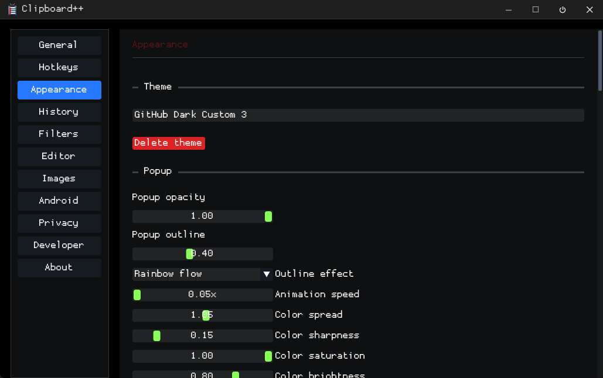

# Clipboard++

Clipboard++ is a Windows clipboard manager built with C++17, Win32, Dear ImGui, DirectX 11, and CMake. It runs as a tray app with a main settings window, an always-on-top quick paste popup, configurable hotkeys, multiple clipboard profiles, and a command-line interface for automation.

This project is under active development. Core clipboard capture, popup paste workflows, configurable hotkeys, multi-clipboard profiles, custom themes, and CLI/config commands are implemented. The encrypted vault and some advanced privacy/developer features are planned but not complete yet.

Clipboard++ is developed by james28909 with close AI-assisted development support from OpenAI Codex and Claude. See [CONTRIBUTORS.md](CONTRIBUTORS.md) for project attribution.

## Screenshots

Main settings window:



Quick paste popup with example history:


## Features

- Clipboard monitoring for text, images, file/folder paths, and common structured content.
- Quick paste popup with search, filter buttons, queue mode, pinned entries, regular history, drag/drop ordering, and right-click item actions.
- Separate pinned and regular history numbering.
- Hidden paste hotkeys for regular history and pinned entries.
- Multiple named clipboard profiles with optional process-aware switching.
- Configurable hotkeys from the settings UI.
- Custom appearance settings with built-in themes, font support, popup opacity/size controls, color pickers, live preview mockups, and named saved custom themes.
- CLI/config commands for showing windows, editing settings, reading/writing the Windows clipboard, and inserting items into Clipboard++ history.
- Developer mode foundations with diagnostics, event logging, source process metadata, and runtime details.

## Platform

- Windows 10+
- Visual Studio 2022 / MSVC
- CMake 3.20+
- C++17

The app is configured to use the static MSVC runtime.

## Repository Layout

```text
src/
  app/          Application lifetime, config, tray, main window ownership
  clipboard/    Clipboard items, history, monitor, content detection, persistence
  cli/          Command-line interface
  hotkeys/      Global keyboard/mouse hook handling and configurable bindings
  ipc/          IPC helpers for short-lived CLI processes
  ui/           Main settings window, popup window, appearance/theme code
  util/         Shared Win32 helpers

resources/      Windows resources
third_party/    Vendored Dear ImGui and nlohmann/json
SPEC.md         Larger feature specification and milestone notes
AGENTS.md       Detailed implementation notes for coding agents
```

## Build

The project is normally built from Visual Studio using the CMake project.

From a Developer PowerShell or from this repo root, this command has been used successfully:

```powershell
Stop-Process -Name clipboardpp -Force -ErrorAction SilentlyContinue
& cmd.exe /c '"C:\Program Files\Microsoft Visual Studio\2022\Professional\Common7\Tools\VsDevCmd.bat" -arch=x64 -host_arch=x64 >nul && "C:\Program Files\Microsoft Visual Studio\2022\Professional\Common7\IDE\CommonExtensions\Microsoft\CMake\CMake\bin\cmake.exe" --build out\build\x64-Debug --config Debug'
```

The debug executable is typically produced at:

```text
out\build\x64-Debug\clipboardpp.exe
```

`CLIPBOARDPP_RESTART_AFTER_BUILD` is enabled by default in `CMakeLists.txt`. On Windows, the build stops a running `clipboardpp.exe` before linking and launches the freshly built executable after a successful build.

## Basic Usage

Run the app:

```powershell
out\build\x64-Debug\clipboardpp.exe
```

Default hotkeys:

| Action | Default |
| --- | --- |
| Open quick paste popup | `Ctrl+Shift+V` |
| Open popup with search focused | `Ctrl+Shift+S` |
| Open settings | `Ctrl+Shift+,` |
| Hidden paste regular history | `Ctrl+Alt+1-9`, `A-Z`, `F1-F12` |
| Hidden paste pinned entries | `Ctrl+Shift+1-9`, `A-Z`, `F1-F12` |
| Select clipboard profile slot | `Alt+Shift+1-9`, `A-Z`, `F1-F12` |

The exact bindings can be changed from Settings -> Hotkeys.

## Popup Notes

The popup is designed to stay on top without stealing focus from the app you are pasting into. It supports:

- keyboard slot paste from visible filtered results
- mouse paste
- queue mode
- pinned entries
- regular history
- right-click item actions
- drag/drop reordering
- search
- web search with `Shift+Enter` from the search box
- custom opacity from the title bar knob

Right-clicking an item currently exposes actions such as paste, copy to clipboard, add/remove queue, move to top/bottom, pin/unpin, and delete.

## CLI

Show help:

```powershell
clipboardpp.exe --help
```

Common commands:

```powershell
clipboardpp.exe --show
clipboardpp.exe --popup
clipboardpp.exe status
clipboardpp.exe status --format json
clipboardpp.exe config --list
clipboardpp.exe config --get popup.opacity
clipboardpp.exe config --set popup.opacity 0.85
clipboardpp.exe config --reset-font
clipboardpp.exe --clipboard get
clipboardpp.exe --clipboard set "hello from the CLI"
clipboardpp.exe --clipboard insert "save this in history" --top
clipboardpp.exe --clipboard "C:\Temp\report.pdf" --bottom --system
```

Commands that insert into Clipboard++ history require the tray app to be running. Config commands can update `config.json` even when the app is not running, and will ask the running app to reload when possible.

## Configuration

Configuration is stored under the current user's roaming app data folder:

```text
%APPDATA%\Clipboard++\config.json
```

Managed imported fonts are stored in:

```text
%APPDATA%\Clipboard++\fonts\
```

The Appearance page can save named custom themes into `config.json`.

## Current Development Status

Implemented:

- clipboard capture and history list
- pinned entries and regular history sections
- multi-clipboard profile metadata
- process-aware clipboard profile routing foundations
- popup paste/search/filter/queue/context menu workflows
- configurable hotkeys
- CLI/config commands
- custom appearance editor and saved custom themes
- developer diagnostics foundation

Planned or partial:

- encrypted vault/archive
- full DPAPI-backed history/vault storage model
- privacy exclusions and secret-handling policy UI
- richer developer tools such as raw format inspection, transforms, templates, exports, and pretty-print workflows

## License

License information has not been finalized in this README yet.

## Acknowledgements

Clipboard++ is being built through a close human/AI development loop: james28909 drives the product direction, testing, and implementation decisions, with AI-assisted development support from OpenAI Codex and Claude.
