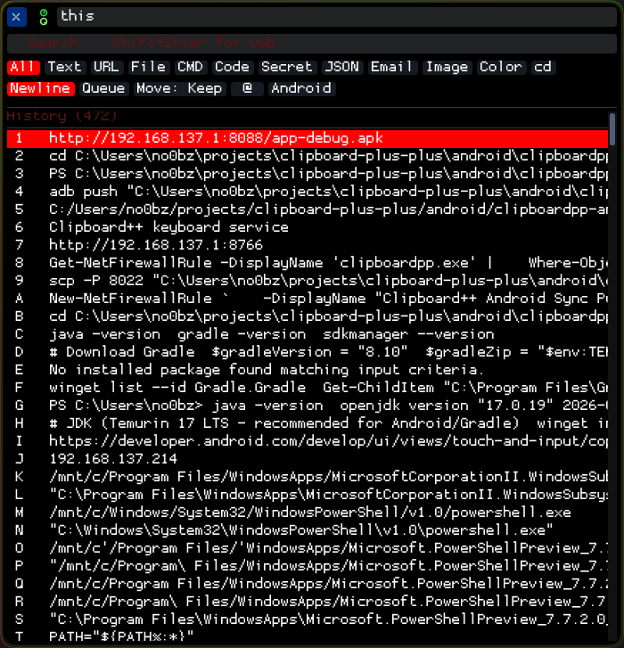
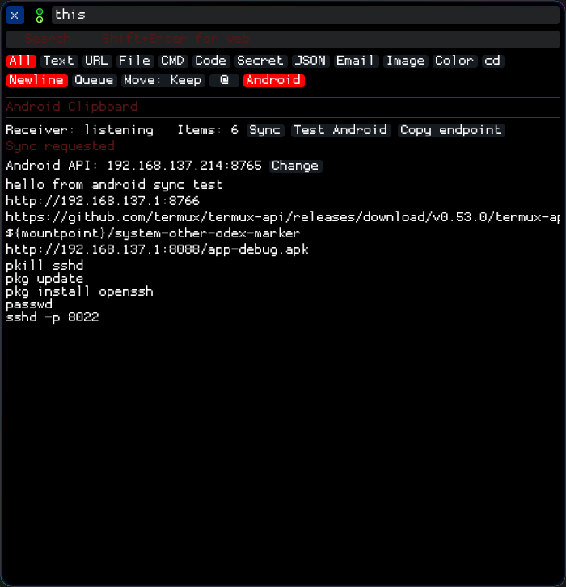
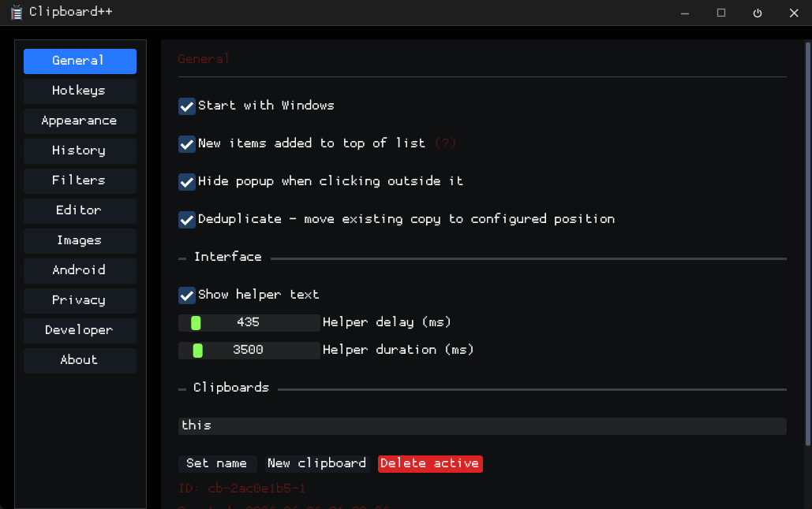
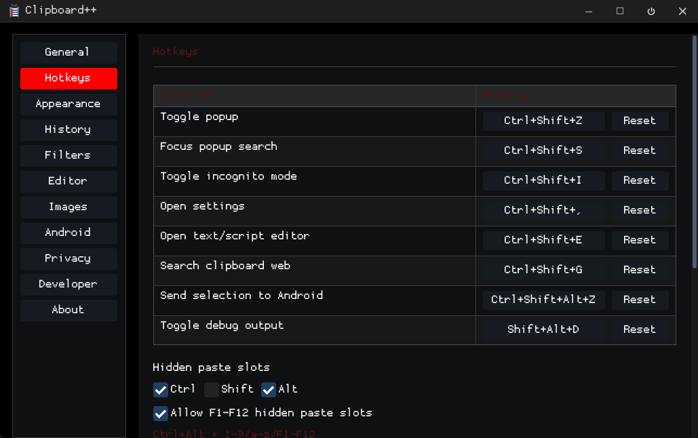
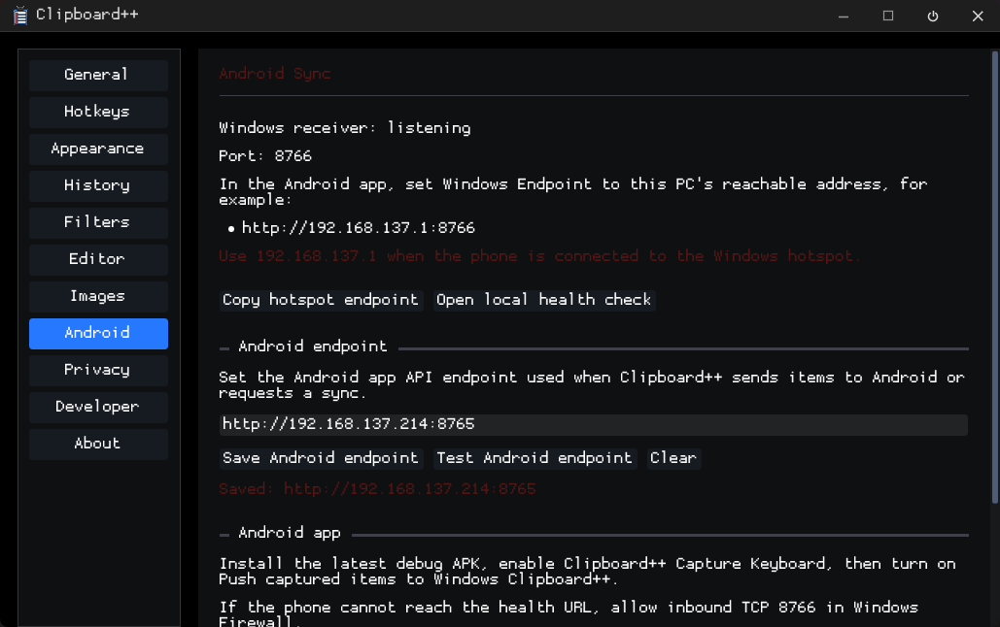

# Clipboard++

Clipboard++ is a fast Windows clipboard manager with searchable history, a non-activating quick-paste popup, multiple clipboard profiles, image capture, configurable hotkeys, themes, Android sync, and command-line control.

It is built in C++17 with Win32, Dear ImGui, DirectX 11, and CMake. The Windows executables use the static MSVC runtime, so no separate runtime installer is required.

**Current release:** `0.1.0-beta.7` · **Supported systems:** Windows 10 and Windows 11<br>
**Author:** james28909, with AI-assisted development from OpenAI Codex and Claude

[Releases](https://github.com/james28909/clipboard-plus-plus/releases) · [Build from source](#building-from-source) · [Keyboard shortcuts](#keyboard-shortcuts) · [Security and storage](#security-and-storage) · [Roadmap](TODO.md) · [Repository map](#repository-map)

## At a glance

- Captures text, rich text, HTML, images, files, folders, and other clipboard formats.
- Opens a searchable quick-paste popup with `Ctrl+Shift+V` without taking focus from the target application.
- Supports pinned items, ordered multi-selection, drag-and-drop reordering, filters, and stable keyboard slots.
- Supports exact left/right modifier hotkeys, configurable history slot banks, named-slot shortcuts, and double-tap overlap routing.
- Archives items displaced by the active-history limit in a searchable per-profile vault, with one-click restore and an optional storage cap.
- Keeps separate named clipboard profiles and can switch profiles based on the foreground process.
- Detects more than 30 content types, including URLs, code, JSON, paths, colors, and likely secrets.
- Stores profiles, persistent history, and images in AES-256-XTS encrypted SQLite databases whose keys are protected by Windows DPAPI.
- Preserves audited native Windows clipboard formats and provides format inspection, hex viewing, regex transforms, templates, diffs, and structured text formatting.
- Syncs clipboard text with the optional Android companion app.
- Includes SQLite and JSON viewers plus a bundled editor target.

Clipboard++ observes the normal Windows clipboard with `AddClipboardFormatListener`. It does not replace `Ctrl+C`, hijack the Windows clipboard UI, or install a different clipboard implementation. A low-level keyboard hook is used for configured global hotkeys and for forwarding keyboard input to the popup, which intentionally does not take foreground focus.

## Quick start

1. Download `clipboardpp.exe` from [Releases](https://github.com/james28909/clipboard-plus-plus/releases), or build it from source.
2. Run the executable. Clipboard++ lives in the system tray.
3. Copy normally with `Ctrl+C`.
4. Press `Ctrl+Shift+V` to open the quick-paste popup.
5. Click an item or use a slot key to paste it into the application that was active before the popup opened.

Use the tray menu or `Ctrl+Shift+,` to open Settings. The General page includes the **Start with Windows** option.

## Screenshots

<details>
<summary>Show screenshots</summary>

| Quick-paste popup | Android clipboard list |
|---|---|
| [](docs/images/Popup-All.png) | [](docs/images/Popup-Android.png) |

| General settings | Appearance settings |
|---|---|
| [](docs/images/Settings-General.png) | [](docs/images/Settings-Appearance.png) |

| Hotkeys | Android settings |
|---|---|
| [](docs/images/Settings-Hotkeys.png) | [](docs/images/Settings-Android.png) |

| Systray |  |
|---|---|
| [](docs/images/Systray-Popup.png) | |

</details>

## Core workflow

### Capture and organize

Clipboard++ continuously captures supported formats. History deduplication is enabled by default, so re-copying existing content refreshes and moves that item according to the configured history order. Disable **Consolidate duplicate clipboard items** under Settings → History to keep every copy as a separate entry.

History features include:

- Pinned and regular sections with independent keyboard slots.
- Named clipboard profiles with isolated histories.
- Process bindings and optional automatic profile switching.
- Search, content filters, custom filters, drag-and-drop ordering, and bulk actions.
- Ordered multi-selection for pasting several items in a chosen order.
- Configurable active-history limits and optional persistence.
- Source-process tracking and timestamps.

### Quick-paste popup

The popup uses `WS_EX_NOACTIVATE`, stays above ordinary windows, and forwards the selected item back to the application that was active when the popup opened. Search and filters operate on stable item IDs, so pasting and bulk actions continue to target the correct entries when the visible list changes.

Ten built-in filter buttons cover All, Text, Image, URL, File, Code, Secret, JSON, Email, and Color. Content detection also recognizes formats such as XML, HTML, CSV, Markdown, UUIDs, dates, logs, commands, scripts, archives, documents, audio, and video paths.

### Advanced paste tools

Developer mode adds tools for inspecting and deliberately transforming clipboard content:

- The format inspector lists every captured Win32 format in order and preserves exact bytes for an audited safe allowlist. A selected safe format or complete safe bundle can be replayed without converting it through plain text.
- The hex viewer displays full preserved payloads, normalized text, and stored image bytes with offset, hexadecimal, and ASCII columns.
- Named slots store reusable encrypted snippets independently of history limits and can be pasted from the popup or assigned global shortcuts.
- PCRE2 regex transforms apply named pattern/replacement rules immediately before paste, with a settings preview.
- Templates interpolate named slots with `{{slot:name}}` and popup selections with `{{1}}`, `{{2}}`, and later ordered placeholders.
- The diff viewer compares two selected items side by side, while structured formatting offers normalized JSON, XML, and SQL paste choices.

Clipboard++ marks its own clipboard-write transactions with a private token. Generated template, transform, and formatted output is therefore not captured back into history as a duplicate, including when Windows emits multiple or delayed format notifications. Developer diagnostics record Clipboard++ as the generator and the receiving foreground process separately.

### Images

Copied images and screenshots can be stored as PNG, JPEG, or raw DIB data. The image browser provides thumbnails, profile filtering, copying, deletion, and configurable quality, dimensions, and retention limits.

### Privacy controls

- Likely-secret detection, highlighting, and optional automatic discard.
- Clear history when Windows locks.
- Per-process exclusions, with common password managers excluded by default.
- AES-256-XTS page encryption for persistent history, profile metadata, and images, with current-user DPAPI protection for the database keys.

## Keyboard shortcuts

All bindings can be changed in Settings → Hotkeys. Bindings distinguish left and right Ctrl, Alt, and Shift and can combine any supported physical modifiers with `1-9`, `A-Z`, or `F1-F12`. History, pinned-history, and profile slot banks define the modifier chord separately from the enabled slot-key ranges; named slots use complete shortcuts.

When a named-slot shortcut overlaps a slot-bank route, optional double-tap routing keeps both actions available: release a required modifier after the first slot-key press for the bank action, or press the same slot key again while continuing to hold the modifiers for the named slot.

| Action | Default |
|---|---|
| Toggle quick-paste popup | `Ctrl+Shift+V` |
| Open popup with search focused | `Ctrl+Shift+S` |
| Open Settings | `Ctrl+Shift+,` |
| Search the web for current clipboard text | `Ctrl+Shift+G` |
| Send highlighted Windows text to Android | `Ctrl+Alt+Shift+Z` |
| Paste a regular-history slot | `Ctrl+Alt+1–9`, `A–Z`, `F1–F12` |
| Paste a pinned slot | `Ctrl+Shift+1–9`, `A–Z`, `F1–F12` |
| Select a clipboard-profile slot | `Alt+Shift+1–9`, `A–Z`, `F1–F12` |

## Android clipboard bridge

The optional companion project is in [`android/clipboardpp-android-api`](android/clipboardpp-android-api). It supports:

- Android-to-Windows clipboard capture into a dedicated Android list.
- Sending one or more saved Windows items back to Android.
- Sending highlighted text from any Windows application with `Ctrl+Alt+Shift+Z`.
- Accessibility-triggered synchronization while keeping Gboard or another keyboard active.
- Manual sync, endpoint testing, missing-item reconciliation, a capture IME, and a floating sync fallback.

Setup and network details are in the [Android companion README](android/clipboardpp-android-api/README.md).

## Security and storage

Clipboard++ stores its user data under `%APPDATA%\Clipboard++`:

| Path | Contents | Protection |
|---|---|---|
| `config.json` | Non-sensitive app settings, hotkeys, and themes | Plaintext; profile definitions are not stored here after migration |
| `clipboard.db` + `.key` | Profiles, active-profile state, active history, and the searchable overflow vault | AES-256-XTS SQLite VFS; key sidecar protected by current-user Windows DPAPI |
| `images.db` + `.key` | Image metadata and image BLOBs | AES-256-XTS SQLite VFS; key sidecar and image BLOBs also use current-user Windows DPAPI |
| `history\<profile>.enc` | Pre-database history retained as a migration rollback source | Current-user Windows DPAPI |
| `fonts\` | Imported fonts | Plain files |

Legacy history and plaintext SQLite databases are migrated automatically. Database replacement uses a verified encrypted copy and a temporary rollback file; profile/history import is transactional. Existing DPAPI history files are retained as a rollback source after successful import. `config.json` stops storing profile names, process bindings, and active-profile state once `clipboard.db` is verified.

Windows DPAPI binds each protected database key to the Windows user credentials that encrypted it and, under the normal Clipboard++ configuration, to the same computer. Merely copying a database and its `.key` sidecar to another account or computer does not make the database readable there. DPAPI also applies an integrity check to the protected key blob so unauthorized modification is detected. This is encryption at rest; it does not protect data from software already running with access to the same signed-in Windows account.

The bundled SQLite Editor detects Clipboard++ `.key` sidecars and opens encrypted databases transparently under the same Windows account. It also recognizes the image schema and decrypts the additional protected image BLOB layer for preview in memory. Choosing **Export decrypted image** deliberately creates an unencrypted file and is labeled accordingly.

## Themes and appearance

Clipboard++ includes 12 built-in dark and light themes plus named custom themes. Appearance controls cover the main palette, title-bar buttons, popup animation, opacity, outlines, scrollbars, rounding, fonts, and the procedural clipboard icon. Theme changes update the main UI, popup contexts, and system-tray icon at runtime.

Install the bundled font collection with:

```powershell
.\install-fonts.ps1
```

You can also import individual `.ttf` and `.otf` files from Settings → Appearance.

## CLI examples

```powershell
clipboardpp.exe status
clipboardpp.exe status --format json
clipboardpp.exe config --list
clipboardpp.exe config --get popup.opacity
clipboardpp.exe config --set popup.opacity 0.85
clipboardpp.exe --clipboard get
clipboardpp.exe --clipboard set "hello"
clipboardpp.exe --clipboard insert "save this" --top
```

### History CLI

History commands use the active profile unless `--profile <id-or-name>` selects another one:

```powershell
clipboardpp.exe get --list --limit 20
clipboardpp.exe get --list --format json
clipboardpp.exe get --search "invoice" --format json
clipboardpp.exe get --item 3
clipboardpp.exe get --item 3 --format json
clipboardpp.exe set --pin 3
clipboardpp.exe set --unpin 1 --profile "Work"
clipboardpp.exe set --delete 5
clipboardpp.exe set --clear --profile "Temporary"
```

Item numbers are one-based positions in the profile's current stored history order. Search results retain their original item numbers, so a result can be passed directly to `get --item <n>`. Text output from `get --item` is the complete stored text payload; JSON output also includes type, pin state, timestamps, source details, and image metadata. It does not write raw image bytes; use the image browser or vault export for image files.

Mutation commands resolve the selected position to a stable item ID and send the change to the running Clipboard++ app, keeping its in-memory history and encrypted database synchronized. Pinning or unpinning can reorder the list, so refresh `get --list` before using another position. `set --clear` clears only the selected profile's active history; it never clears that profile's vault. These commands require the tray app to be running.

### Vault CLI

Vault commands use the active profile unless `--profile <id-or-name>` selects another one:

```powershell
clipboardpp.exe vault count --format json
clipboardpp.exe vault search "invoice" --limit 20
clipboardpp.exe vault export --output "C:\Temp\vault-files" --format files
clipboardpp.exe vault export --output "C:\Temp\vault.json" --format json
clipboardpp.exe vault export --output "C:\Temp\vault.cppvault" --format binary
clipboardpp.exe vault backup --output "D:\Backups\Clipboard++"
```

The `files`, `json`, and `binary` export formats contain decrypted clipboard content and must be protected accordingly. File and binary exports preserve image payloads in their exact stored PNG, JPEG, or DIB representation. The `backup` command is different: it uses SQLite's online backup API to create consistent encrypted copies of `clipboard.db` and `images.db`, each with a new DPAPI-protected key, without creating an intermediate plaintext database. Its destination directory must be empty.

The GUI is single-instance. Commands that change live app state communicate with the running app through the Clipboard++ IPC window.

## Companion projects

| Directory | Output | Purpose |
|---|---|---|
| `.` | `clipboardpp.exe` | Main Windows clipboard manager |
| `android/clipboardpp-android-api` | Android APK | Android clipboard companion |
| `ide/` | `clipboardpp_ide.exe` | Bundled text/script editor |
| `dbviewer/` | `sqlite_editor.exe` | SQLite browser, query editor, and image-BLOB previewer |
| `jsonviewer/` | `json_viewer.exe` | JSON tree viewer and syntax highlighter |

The SQLite and JSON viewer directories include optional `.reg` templates for Explorer integration. They can be installed normally or loaded dynamically through [AwesomeMenu](https://github.com/james28909/AwesomeMenu). See the [SQLite Editor README](dbviewer/README.md) and [JSON Viewer README](jsonviewer/README.md) for tool-specific usage.

## Building from source

### Requirements

- Visual Studio 2022 with **Desktop development with C++**
- CMake 3.20 or newer
- PowerShell

### Build script

```powershell
# All Windows targets, Release
.\build.ps1

# One target, Debug
.\build.ps1 -Target clipboardpp -Config Debug
.\build.ps1 -Target sqlite_editor -Config Debug

# Every target in both configurations
.\build.ps1 -Config Both

# Clean rebuild
.\build.ps1 -Target clipboardpp -Config Debug -Clean
```

Executables are written to `build\<Config>\<target>\`.

Available targets are `clipboardpp`, `clipboardpp_ide`, `sqlite_editor`, and `json_viewer`. The main Clipboard++ CMake target stops and restarts the matching executable after a successful build unless `CLIPBOARDPP_RESTART_AFTER_BUILD=OFF` is configured.

### Manual CMake

```powershell
cmake -S . -B build/.cmake/clipboardpp -G "Visual Studio 17 2022" -A x64
cmake --build build/.cmake/clipboardpp --config Debug

cmake -S dbviewer -B build/.cmake/sqlite_editor -G "Visual Studio 17 2022" -A x64
cmake --build build/.cmake/sqlite_editor --config Debug
```

Do not pass `CMAKE_BUILD_TYPE` when using the Visual Studio multi-configuration generator.

### Android

Open `android/clipboardpp-android-api` in Android Studio, or build it with a local Gradle installation:

```powershell
cd android\clipboardpp-android-api
gradle :app:assembleDebug
```

## Repository map

The main application is intentionally divided by responsibility so the central coordinator and UI windows remain manageable:

```text
src/
  app/          Application orchestration, config, tray icon, startup registration
  android/      Windows-side Android client, sync server, integration coordinator
  clipboard/    Monitor, items, histories, profile manager, persistence, image store
  security/     Windows DPAPI protection and encrypted SQLite VFS
  hotkeys/      Global hotkeys and popup keyboard forwarding
  filters/      Custom filter matching
  transforms/   Named PCRE2 paste transforms
  templates/    Named-slot and ordered-selection interpolation
  formatting/   Structured JSON, XML, and SQL formatting
  diff/         Line-aligned clipboard item comparison
  ipc/          CLI-to-GUI IPC
  ui/           Windows, themes, widgets, selection, paste diagnostics
  util/         Shared Win32 helpers
```

Large UI responsibilities are split into focused translation units:

- `MainWindow*.cpp` contains one Settings page per file.
- `PopupWindowHistory.cpp`, `PopupWindowImages.cpp`, `PopupWindowPaste.cpp`, and `PopupWindowAndroid.cpp` isolate popup subsystems.
- `PopupSelectionModel` owns stable ordered item selection.
- `PasteDiagnostics` centralizes paste and hotkey diagnostic formatting.
- `ClipboardProfileManager` owns profile history lifetime, persistence, switching, duplication, and deletion.
- `AndroidIntegration` owns Android connection, synchronization, and device coordination.

Other useful locations:

```text
tests/          Main application tests
dbviewer/       SQLite Editor and its tests
jsonviewer/     JSON Viewer
resources/      Windows resources and manifest
icons/          SVG/ICO source and build tooling
themes/         Theme presets
docs/images/    README screenshots
third_party/    Vendored dependencies
SPEC.md         Detailed feature specification
TODO.md         Current implementation roadmap
AGENTS.md       Implementation notes and project gotchas
```

## License and acknowledgements

License information has not been finalized.

Developed by james28909 with AI-assisted development from OpenAI Codex and Claude. See [CONTRIBUTORS.md](CONTRIBUTORS.md) for attribution.
