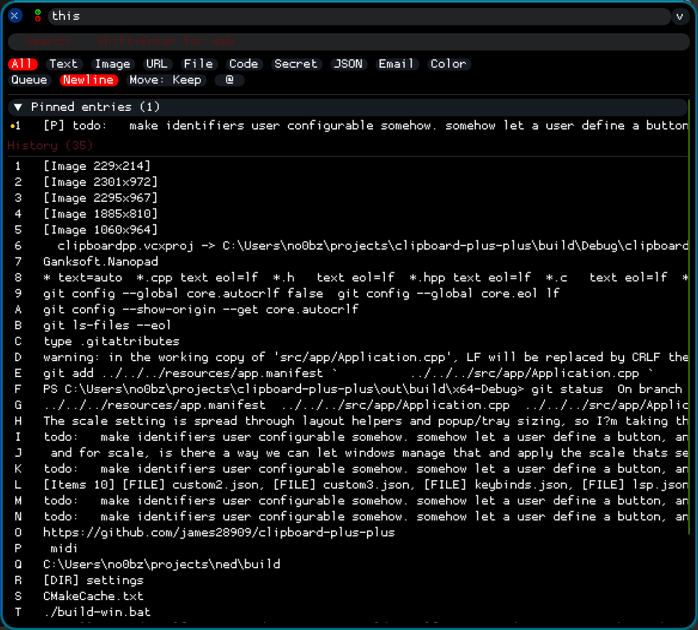
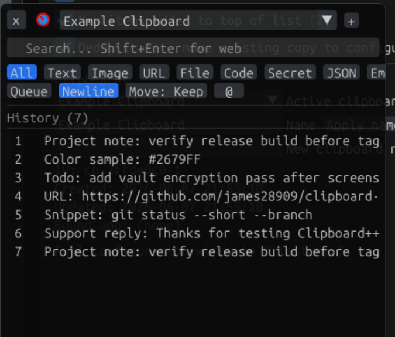
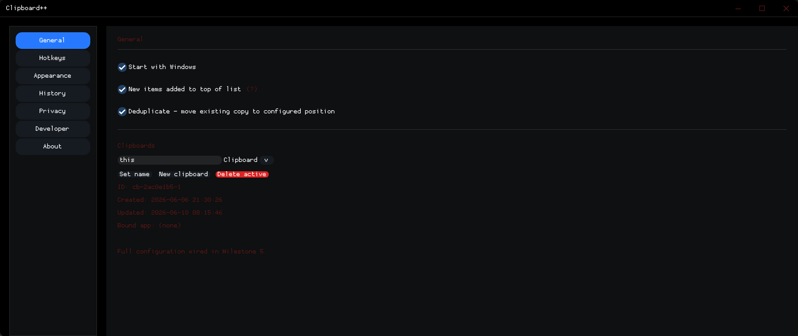
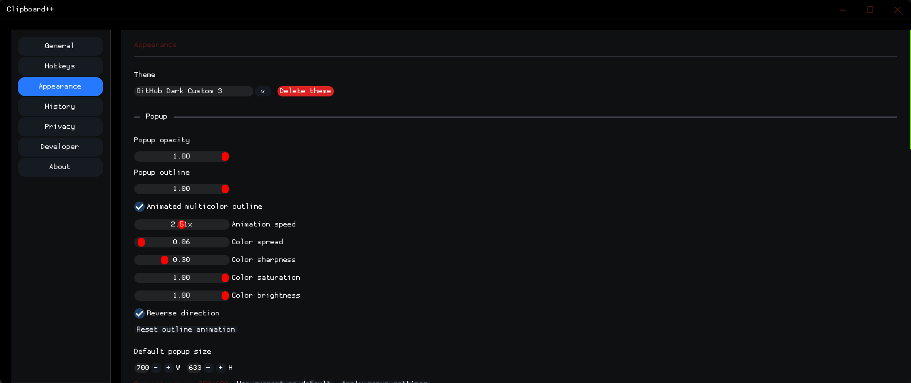
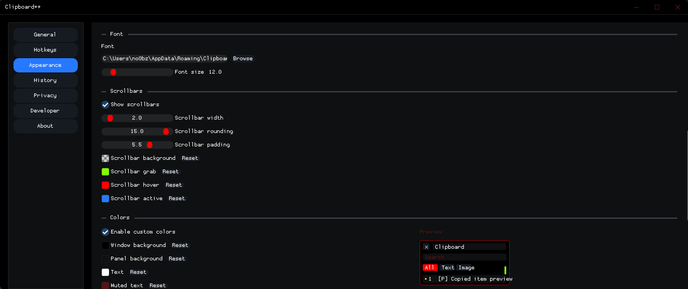
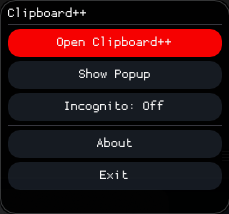
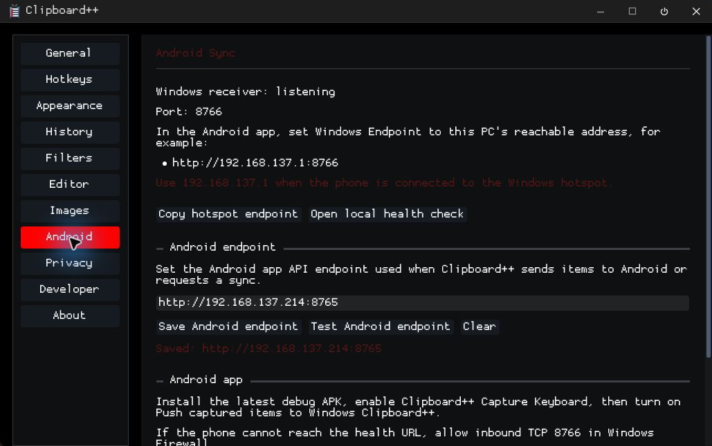
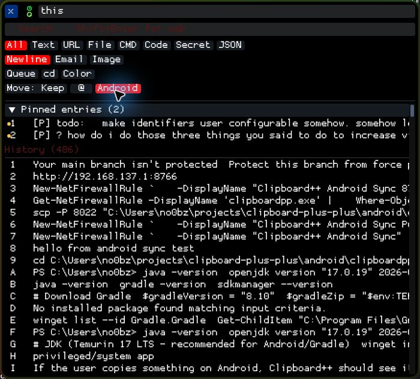

# Clipboard++

A lean, modern Windows clipboard manager built with C++17, Dear ImGui (docking branch), DirectX 11, and CMake. Runs as a system tray app with a main settings window, an always-on-top quick paste popup, configurable hotkeys, multiple named clipboard profiles, image capture, Android clipboard sync, and a CLI.

**Current release:** Beta 3  
**Platform:** Windows 10 / 11 — no installer, no runtime required  
**Developed by:** james28909 with AI-assisted development from OpenAI Codex and Claude

---

## Projects in this repository

This repository contains multiple Clipboard++ tools and companion projects that share the same build and configuration direction.

| Project | Executable | Description |
|---|---|---|
| **Clipboard++** | `clipboardpp.exe` | Main clipboard manager — system tray app, popup, settings |
| **Clipboard++ Android API** | Android APK | Companion Android app for Android clipboard capture and sync |
| **Clipboard++ IDE** | `clipboardpp_ide.exe` | Bundled editor target for text/script workflows |
| **SQLite Editor** | `sqlite_editor.exe` | Standalone SQLite database viewer and query tool |
| **JSON Viewer** | `json_viewer.exe` | Standalone JSON file viewer with syntax highlighting and tree view |

All three are built from the same repository root using a single build script. Each has its own context menu `.reg` template for Windows Explorer shell integration.

---

## Screenshots

Quick paste popup:


Popup with history and controls:


General settings:


Appearance settings (page 1):


Appearance settings (page 2):


System tray popup:


Android sync settings:


Popup Android entry point:


---

## Features

### Android Clipboard Bridge
- Companion Android app under `android/clipboardpp-android-api`
- Android clipboard capture through the enabled Clipboard++ Capture Keyboard / IME path
- Floating Android sync button that captures the current Android clipboard and pushes new items to Windows
- Dedicated Android list in the Clipboard++ popup
- Persistent Android endpoint setting in Settings -> Android
- Manual sync and endpoint health-test controls from Clipboard++
- Send one or many Clipboard++ profile items to Android from the item context menu
- Send highlighted Windows text to Android with the configurable `Ctrl+Alt+Shift+Z` hotkey
- Missing-item reconciliation so already captured Android items can be pushed again if Windows does not currently have them

### Clipboard Capture
- Monitors the Windows clipboard continuously for text, images, file/folder paths, and structured content
- Automatic deduplication — re-copying the same content moves it in the history rather than creating a duplicate
- Image capture pipeline — screenshots and copied images are stored and viewable in-app
- Configurable max history size (1–8192 items)
- Optional history persistence across sessions
- Source process tracking — each item records which application it came from

### Quick Paste Popup (`Ctrl+Shift+V`)
- Always-on-top overlay that does not steal focus from the target application
- Keyboard slot paste — press `1-9`, `a-z` to instantly paste the corresponding item
- Search bar with live filtering (`Ctrl+Shift+S` to open with search focused)
- 10 content type filter buttons: All, Text, Image, URL, File, Code, Secret, JSON, Email, Color
- Queue mode — select multiple items and paste them in sequence
- Window opacity knob and outline strength knob, adjustable by mouse wheel
- Animated multi-color outline effect with configurable speed, spread, sharpness, saturation
- Drag-and-drop item reordering
- Right-click item context menu

### Item Context Menu
- Paste, Copy, Add/Remove from paste queue
- Move to top / move to bottom, Pin / unpin, Delete

### Multiple Clipboard Profiles
- Create any number of named clipboard profiles, each with its own independent history
- Integrated combo input in the popup title bar — click to open list, type to name, Save to create
- Right-click a profile in the picker to Duplicate or Delete it
- Process-aware auto-switching — bind a profile to an application's executable name

### Image Store
- Captured images are stored on disk with automatic deduplication
- In-app browser with thumbnail grid — click to copy back to clipboard
- Images stored under `%APPDATA%\Clipboard++\images\`
- Settings page for storage limits, quality, and format preferences

### Content Type Detection
30+ automatic content type tags:

| Category | Tags |
|---|---|
| Network | URL, Email, IP address |
| Code | Code, SQL, Command, Script, Config |
| Data | JSON, XML, HTML, CSV, Markdown, Base64, Hex color, UUID, Date, Log, Phone |
| Security | Secret (AWS keys, GitHub tokens, JWTs, PEM blocks, Slack tokens, API keys) |
| Files | File, Folder, Path, Image file, Document, Archive, Executable, Script, Config, Data, Audio, Video |

Secret items are highlighted in red. Auto-discard of detected secrets is available.

### Appearance and Themes
12 built-in themes: Dark Default, Dracula, Nord, Monokai, One Dark Pro, Tokyo Night, Solarized Dark, GitHub Dark, GitHub Light, Solarized Light, VS Light, Quiet Light

Full appearance customization including:
- Per-theme icon colors (board gradient, paper, margin line, ruled lines) — the in-app clipboard icon updates live with the theme
- Title bar button base and hover colors (minimize, maximize, close)
- 14 individually configurable UI colors
- Animated outline, scrollbar controls, corner rounding, font import
- Save and name unlimited custom themes

### Hotkeys
All configurable from Settings → Hotkeys.

| Action | Default |
|---|---|
| Toggle quick paste popup | `Ctrl+Shift+V` |
| Open popup with search focused | `Ctrl+Shift+S` |
| Open settings | `Ctrl+Shift+,` |
| Web search current clipboard | `Ctrl+Shift+G` |
| Send highlighted selection to Android | `Ctrl+Alt+Shift+Z` |
| Hidden paste — history slot | `Ctrl+Alt+1-9`, `A-Z`, `F1-F12` |
| Hidden paste — pinned slot | `Ctrl+Shift+1-9`, `A-Z`, `F1-F12` |
| Select clipboard profile slot | `Alt+Shift+1-9`, `A-Z`, `F1-F12` |

### Privacy
- Secret pattern detection with optional auto-discard
- Clear history when Windows locks
- Per-process exclusion list (KeePass, 1Password, Bitwarden included by default)

### CLI
```powershell
clipboardpp.exe status
clipboardpp.exe status --format json
clipboardpp.exe config --list
clipboardpp.exe config --get popup.opacity
clipboardpp.exe config --set popup.opacity 0.85
clipboardpp.exe --clipboard get
clipboardpp.exe --clipboard set "hello"
clipboardpp.exe --clipboard insert "save this" --top
```

---

## AwesomeMenu Integration

[AwesomeMenu](https://github.com/james28909/AwesomeMenu) is a Windows context menu overlay that lets you load custom shell commands from `.reg` files placed in `%APPDATA%\AwesomeMenu\menus\`. It acts as a live overlay for the Windows registry — no reboot or re-login needed, changes are instant.

This repository ships `.reg` templates for each tool:

| Template | Location |
|---|---|
| `dbviewer/sqlite_editor.reg` | Right-click `.db`, `.sqlite`, `.sqlite3` files → "Open with SQLite Editor" |
| `jsonviewer/json-viewer.reg` | Right-click `.json` files → "Open with JSON Viewer" |

### Installing with AwesomeMenu

1. Build AwesomeMenu following its repo instructions. Copy the AwesomeMenu DLL into your shell.
2. Copy the `.reg` file for the tool you want into `%APPDATA%\AwesomeMenu\menus\`.
3. Right-click the file type — the menu item appears immediately In AwesomeMenu right-click context menu.

No registry reboot required. AwesomeMenu handles loading and unloading dynamically.

### Adding right-click handlers for other shell objects

The `.reg` templates above use file extension keys (`HKCR\.db\shell\...`). Windows supports context menu entries for many other shell objects using different registry class names. Place the corresponding `.reg` file in the AwesomeMenu menus folder:

| What you right-click | Registry class |
|---|---|
| A specific file extension | `HKCR\.ext\shell\` |
| Any file (all types) | `HKCR\*\shell\` |
| Any folder | `HKCR\Directory\shell\` |
| Inside a folder (empty space) | `HKCR\Directory\Background\shell\` |
| A drive (C:, D:, etc.) | `HKCR\Drive\shell\` |
| Desktop background | `HKCR\DesktopBackground\shell\` |

Example `.reg` to add "Open Terminal Here" when right-clicking any drive:

```reg
Windows Registry Editor Version 5.00

[HKEY_CLASSES_ROOT\Drive\shell\OpenTerminal]
@="Open Terminal Here"
"Icon"="C:\\Windows\\System32\\cmd.exe,0"

[HKEY_CLASSES_ROOT\Drive\shell\OpenTerminal\command]
@="cmd.exe /k \"cd /d %1\""
```

Drop this in `%APPDATA%\AwesomeMenu\menus\` and right-click any drive — it appears instantly.

---

## Platform

- Windows 10 / 11
- Visual Studio 2022 / MSVC
- CMake 3.20+
- C++17
- No external runtime — static MSVC runtime linkage

---

## Repository Layout

```text
src/                  Clipboard++ source
  android/            Windows-side Android HTTP client and sync server
  app/                Application lifetime, config, tray, main window ownership
  clipboard/          Clipboard items, history, monitor, content detection, persistence
  cli/                Command-line interface
  filters/            Custom filter matching and routing
  hotkeys/            Global keyboard/mouse hook and configurable bindings
  ipc/                IPC helpers for CLI → GUI communication
  ui/                 All windows (main, popup, tray popup, debug), appearance/theme engine

android/              Android companion app project
ide/                  Clipboard++ IDE/editor sub-project
dbviewer/             SQLite Editor sub-project
  src/                C++ source
  res/                Windows resource file and manifest
  sqlite_editor.reg   Right-click .db/.sqlite shell integration template

jsonviewer/           JSON Viewer sub-project
  src/                C++ source
  res/                Windows resource file and manifest
  json-viewer.reg     Right-click .json shell integration template

resources/            Clipboard++ Windows resources (manifest, icon)
icons/                SVG sources + ICO build tools (see icons/README.md)
themes/               Built-in theme JSON presets
third_party/          Vendored Dear ImGui, nlohmann/json, SQLite3, PCRE2, Scintilla
assets/fonts/         Bundled fonts
docs/images/          Screenshots
tools/                Build helpers

build.ps1             Build script (all targets, Release/Debug, optional clean)
release.ps1           Version bump + GitHub release automation
SPEC.md               Feature specification
AGENTS.md             Detailed implementation notes for coding agents
```

---

## Build

### Prerequisites

- Visual Studio 2022 (Community or higher) with **Desktop development with C++**
- CMake 3.20+ (bundled with VS, or install separately)
- `gh` CLI — for `release.ps1` only ([cli.github.com](https://cli.github.com))

### Build script (recommended)

```powershell
# Build all Windows projects, Release
.\build.ps1

# Build a specific target
.\build.ps1 -Target clipboardpp
.\build.ps1 -Target clipboardpp_ide
.\build.ps1 -Target sqlite_editor
.\build.ps1 -Target json_viewer -Config Debug

# Build all targets, both Release and Debug
.\build.ps1 -Config Both

# Clean rebuild
.\build.ps1 -Clean
.\build.ps1 -Target clipboardpp -Clean -Config Both
```

Output paths:
```
build\Release\clipboardpp\clipboardpp.exe
build\Release\clipboardpp_ide\clipboardpp_ide.exe
build\Release\sqlite_editor\sqlite_editor.exe
build\Release\json_viewer\json_viewer.exe

build\Debug\clipboardpp\clipboardpp.exe
build\Debug\clipboardpp_ide\clipboardpp_ide.exe
build\Debug\sqlite_editor\sqlite_editor.exe
build\Debug\json_viewer\json_viewer.exe
```

### Android companion app

The Android companion is a separate Gradle project:

```powershell
cd android\clipboardpp-android-api
gradle :app:assembleDebug
```

If Gradle is not on PATH, use your local Gradle install or open `android/clipboardpp-android-api` in Android Studio. See [android/clipboardpp-android-api/README.md](android/clipboardpp-android-api/README.md) for setup and endpoint details.

### Manual CMake

```powershell
# Clipboard++
cmake -S . -B build/.cmake/clipboardpp
cmake --build build/.cmake/clipboardpp --config Release

# SQLite Editor
cmake -S dbviewer -B build/.cmake/sqlite_editor
cmake --build build/.cmake/sqlite_editor --config Release

# JSON Viewer
cmake -S jsonviewer -B build/.cmake/json_viewer
cmake --build build/.cmake/json_viewer --config Release
```

### Publishing a release

```powershell
# Bump version, build all, create GitHub release
.\release.ps1 -Notes "What changed in this release."

# Include debug symbol files (.pdb)
.\release.ps1 -Notes "..." -IncludePdbs

# Test the pipeline without pushing
.\release.ps1 -DryRun
```

`release.ps1` will:
1. Increment the beta build number in `VERSION` and `MainWindow.cpp`
2. Build all three projects in both Release and Debug
3. Rename debug executables with a `d` suffix (`clipboardppd.exe`, etc.)
4. Commit + tag the version bump
5. Push and create a GitHub pre-release with all six executables attached

---

## Fonts

A curated set of fonts is included in the repository as `fonts.zip`. To install them into the correct location automatically, run from the repo root:

```powershell
.\install-fonts.ps1
```

This extracts all fonts to `%APPDATA%\Clipboard++\fonts\` with no dependencies — just Windows built-in ZIP support. Once installed, select any font in Settings → Appearance → Font.

You can also import any `.ttf` or `.otf` font manually from the Appearance settings page.

---

## Configuration

```text
%APPDATA%\Clipboard++\config.json        Main settings
%APPDATA%\Clipboard++\fonts\             Imported fonts (populated by install-fonts.ps1)
%APPDATA%\Clipboard++\history\           Per-profile clipboard history (JSON)
%APPDATA%\Clipboard++\images\            Captured images
```

The Android device API endpoint is stored in the same config file under the `android.deviceEndpoint` setting.

---

## Development Status

**Stable and complete:**
- Clipboard capture, deduplication, persistent history
- Pinned entries with independent slot numbering
- Multi-clipboard profiles with process binding and auto-switching
- Quick paste popup: search, filter, queue, drag-drop, context menu
- Configurable hotkeys including hidden paste slots
- Full appearance editor: 12 built-in themes, custom saved themes
- Theme-driven icon (updates live in-app and system tray on theme switch)
- Title bar button color customization (base + hover for min/max/close)
- Image capture, deduplication, and in-app browser
- Animated outline effect with full parameter control
- DPI-aware rendering with custom scrollbar theming
- Privacy: secret detection, auto-discard, process exclusion, clear-on-lock
- CLI/IPC interface
- System tray popup menu
- Android clipboard bridge: Android companion app, Windows sync server, dedicated popup list, endpoint persistence, and send-to-Android actions
- Global send-selection-to-Android hotkey
- Custom filters and filter matcher tests
- Bundled editor/IDE target
- SQLite Editor — standalone database viewer (sub-project)
- JSON Viewer — standalone JSON viewer (sub-project)

**Planned:**
- Encrypted vault/archive (DPAPI-backed)
- Full privacy exclusions UI
- Richer developer tools (raw format inspection, transforms, export)
- Expanded CLI coverage for profile and vault commands

---

## License

License information has not been finalized yet.

## Acknowledgements

Developed by james28909 with AI-assisted development from OpenAI Codex and Claude.
See [CONTRIBUTORS.md](CONTRIBUTORS.md) for project attribution.
